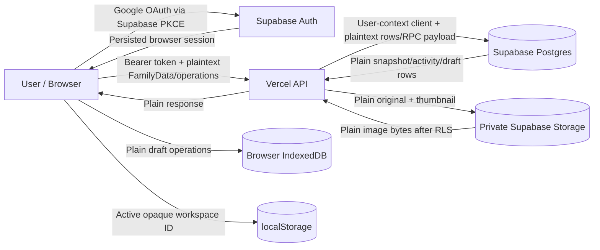
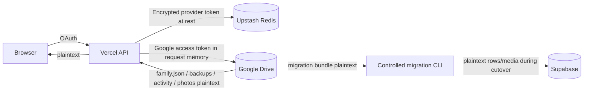
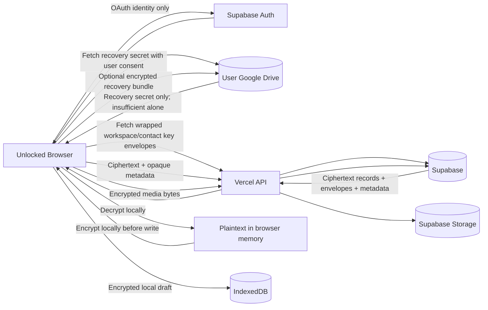

# CR-01 Data Flow and Plaintext Boundary

## Current production-compatible flow

Trong flow hiện tại, TLS bảo vệ dữ liệu khi truyền và RLS/private bucket hạn chế account nào đọc được. Tuy nhiên Vercel runtime, Supabase database/Storage và provider backups vẫn có khả năng xử lý/giữ plaintext. Đây không phải E2EE.

## Legacy rollback/migration flow

Encryption of Google OAuth tokens in Redis protects credentials at rest; nó không mã hóa FamilyData trong Drive.

## Target flow sau CR-11

## Target plaintext boundary

### Plaintext được phép

- Trong browser memory sau khi user xác thực, unlock thành công và được cấp key phù hợp.
- Trong user-initiated import parser trước khi encrypt, với file không upload lên server.
- Trong user-initiated export/download sau authorization + export policy check.
- Recovery secret được phép tồn tại plaintext chỉ trong browser memory sau khi đọc từ private Drive vault. Drive vault file có thể chứa recovery secret nhưng không raw workspace/content key và riêng file này không đủ giải mã nếu không có encrypted key material từ Supabase hoặc encrypted recovery bundle.
- Recovery bundle luôn là ciphertext at rest/in transit. Plaintext bundle chỉ được materialize tạm trong browser memory trong một thao tác restore đã xác nhận.

### Plaintext không được phép

- Vercel request/response body, logs, error details hoặc tracing attributes.
- Supabase tables, RPC args/results, Storage objects, database snapshots, exports/backups bucket.
- IndexedDB/localStorage/Cache API/service worker cache.
- Family/contact/media plaintext không bao giờ được nằm trong URL/query/hash, referrer, filenames/object paths, activity summary, analytics event hoặc crash report. Access token, refresh token, recovery/key material và invitation bearer cũng bị cấm trong target URL. Ngoại lệ protocol hẹp: PKCE single-use authorization `code` + `state` trên exact OAuth callback, bound to browser verifier, `no-referrer`, immediately exchanged/scrubbed and never logged.
- Git, CI artifact, test fixture/evidence dùng dữ liệu thật.

## Server-readable plaintext whitelist — authoritative

Đây là closed whitelist và là nguồn sự thật duy nhất cho CR-04 trở đi. Field không được liệt kê mặc định phải mã hóa hoặc bị loại bỏ; muốn thêm field cần sửa CR-01 bằng security review + owner approval mới.

| Purpose | Plaintext fields allowed |
|---|---|
| Account/collaboration identity | account ID, login email, display name/avatar URL, provider subject; các `account-pii` này không được log/analytics và chỉ đọc theo purpose collaboration |
| Workspace authorization/routing | random workspace ID, owner/member account ID, role, membership timestamps; non-authorizing 8-character join code + rotation/status; invitation target email/hash/status/expiry trong legacy transition only |
| Contact authorization | confirmed member-to-opaque-person binding ID; contact record opaque `person_id`, fixed `field_class`, key epoch; policy/grant version, recipient principal/fingerprint, authorization purpose/expiry/signature. Server không biết name, relation path hoặc graph edges |
| Crypto principal/envelope routing | portable principal ID, public encryption/signing keys and fingerprints, key/envelope opaque ID, recipient principal ID, purpose, key epoch, algorithm/schema/crypto version, issuer ID, wrapped bytes, signature |
| Encrypted container | random record/object ID, workspace ID, coarse container class `family-content`/`contact`/`media`, crypto/schema version, key ID/epoch, nonce, ciphertext, authentication tag |
| Concurrency/workflow | data/base revision, random commit/draft/operation ID, actor account ID, state/decision, operation/container count, operational created/updated/expiry timestamps |
| Integrity/idempotency | random idempotency token; ciphertext/envelope checksum or keyed digest with key unavailable to server. Plaintext-domain hash is forbidden |
| Storage/retention | random opaque object path, generic encrypted-blob MIME, ciphertext byte length, upload/cleanup state, attempt count, retention/terminal timestamp |
| Security/operations log | fixed event/error code, actor/account/workspace opaque ID, route template, HTTP status, timestamp, latency, rate-limit counters; no entity mapping, family value, free-text provider error or key/token |

Whitelist không cho phép tên gia đình/người, general profile-person mapping, graph endpoint/type, subject, ngày sinh/mất, gender, relationship dates/status, phone/address, note, timezone/locale family preference, caption, EXIF, image/thumbnail plaintext, free-text review/activity/error hoặc domain `createdAt`/`updatedAt`. Contact authorization exception ở trên làm lộ rằng một opaque person có field/grant nhất định, nhưng không làm lộ field value hay family topology.

## Luồng token và URL

| Flow | Boundary | Required mitigation |
|---|---|---|
| Supabase OAuth PKCE | Browser ↔ Supabase/Google; callback URL mang single-use `code` + `state`; SDK persists resulting session | Exact redirect allowlist, verifier/state binding, no-referrer, immediate scrub, CSP/XSS controls; target rejects access/refresh token in URL/hash |
| Supabase bearer API | Browser → Vercel → Supabase user client | Header only, never query/body/log; short expiry and SDK refresh |
| Family invitation hiện tại | One-time raw token in `?invite=...`, DB stores SHA-256 hash | Legacy exception only: immediate `replaceState`, expiry/single-use/email binding, no-referrer/no third-party loads. CR-13 phải thay bằng non-authorizing join code/POST flow; target cấm bearer secret trong URL. |
| Legacy Drive OAuth | HttpOnly SameSite cookie; encrypted tokens in Redis; access token in server memory | Rollback-only, server key rotation, TTL and purge after rollback window |
| Future recovery Drive | Explicit user authorization for key vault | Least privilege, exact app-created files, recovery secret never sent to Supabase/Vercel logs |

## Search, calendar and analytics

Current search/calendar/analytics calculate in the browser from loaded FamilyData. Target keeps them client-side after decryption. Không tạo server search index từ tên, ngày sinh, địa chỉ hay topology. Nếu tương lai cần server index, đó là CR security riêng với leakage analysis.
